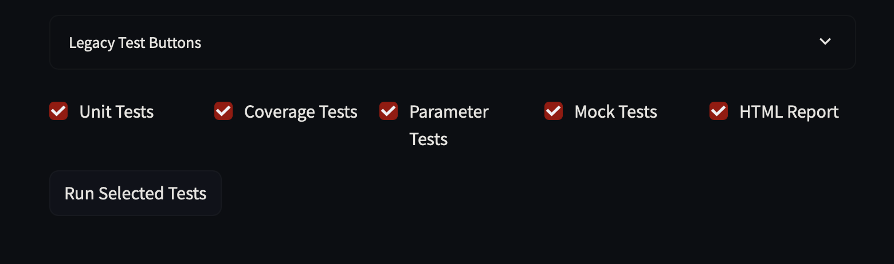
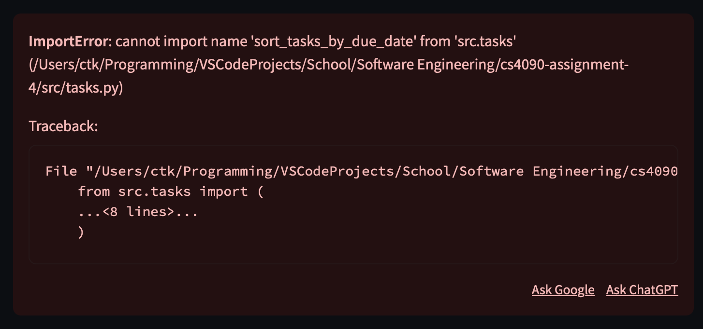
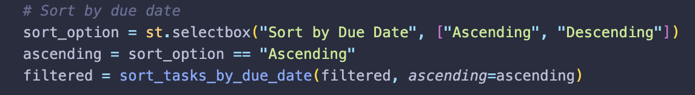
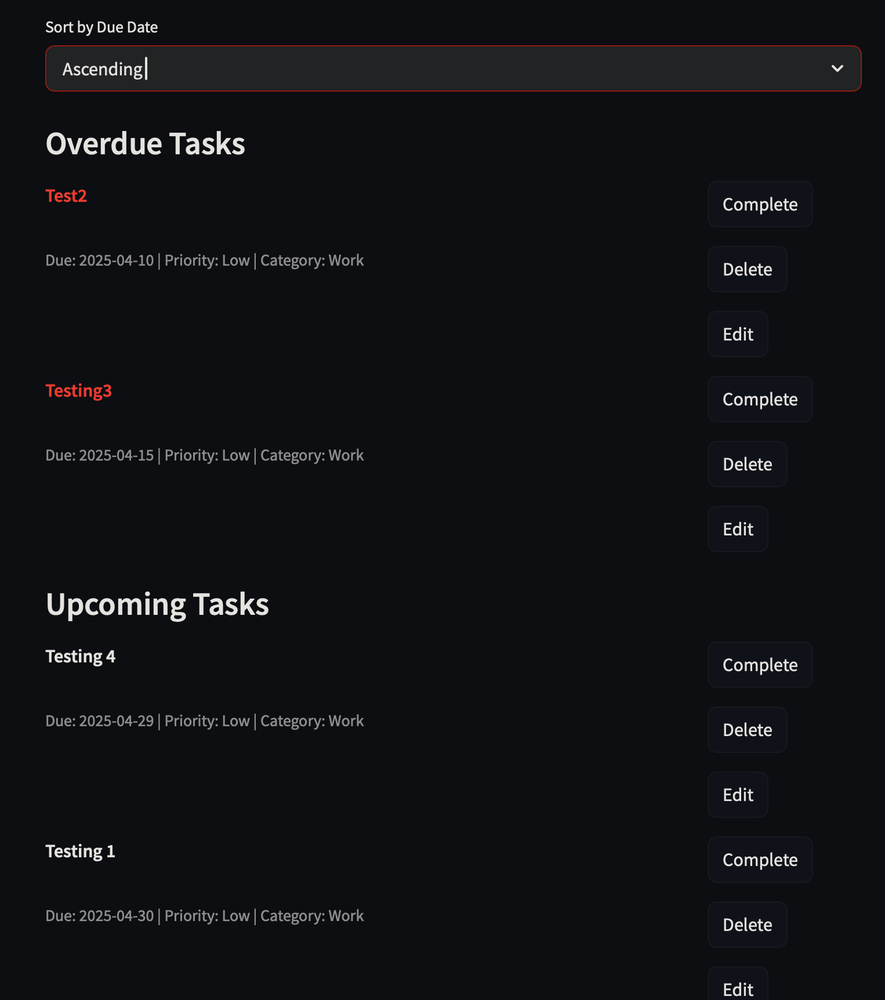
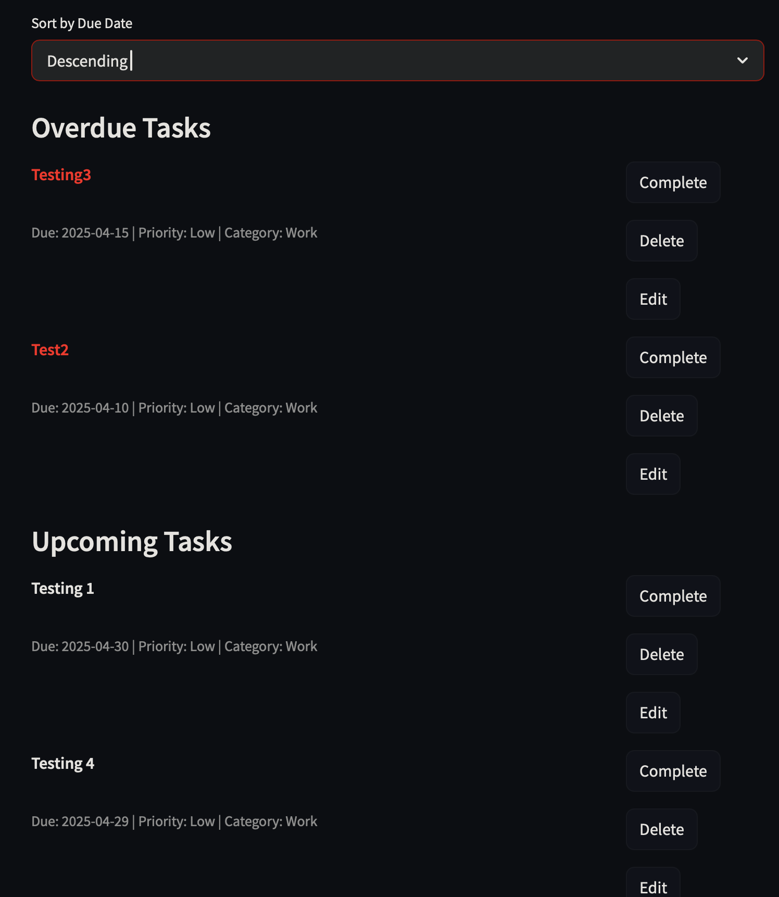
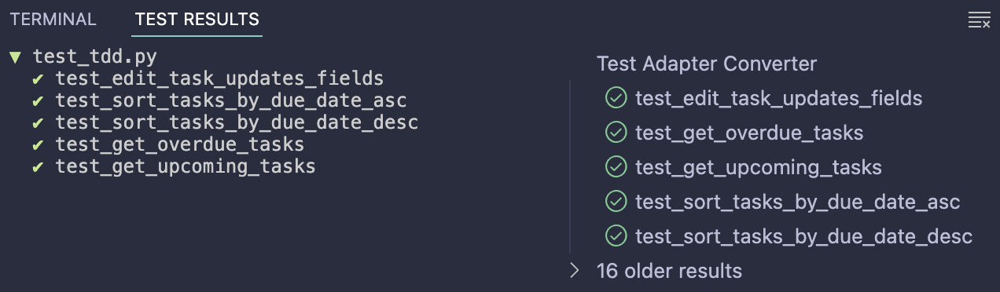

# First Impressions

* Original code generated IDs via `len(tasks) + 1`, leading to duplicate IDs after deletions.
* New tasks did not appear immediately; UI lacked `st.rerun()` calls for instant refresh.
* Corrupted `tasks.json` printed warnings only to console, not visible in Streamlit UI.
* Filter dropdowns built from `set(...)` produced unpredictable category order.
* No built‑in button or mechanism to run tests from the Streamlit app.
* Business logic (task creation and filtering) was mixed directly into UI code, making unit testing difficult.

---

## Unit Testing Coverage and Refactoring Summary

Achieved **100% overall** coverage across all test suites for both `src/app.py` and `src/tasks.py` by:

1. **Streamlit Test Buttons in `app.py`**  
   - "Run Unit Tests" triggers `pytest -q`.  
   - "Run Coverage" triggers `pytest --cov=src --cov-report=html`.  
   - "Run Param Tests" triggers `pytest tests/test_param.py`.  
   - "Run Mock Tests" triggers `pytest tests/test_mock.py`.  
   - "Run HTML Report" triggers `pytest --html=report.html --self-contained-html`.

2. **Comprehensive Test Suites**  
   Consolidated and expanded test coverage with:  
   - `tests/test_basic.py` (basic unit tests)  
   - `tests/test_advanced.py` (fixtures & parameterization)  
   - `tests/test_tdd.py` (TDD-driven examples)  
   - `tests/test_property.py` (hypothesis property-based tests)  
   - `tests/test_param.py` (parameterized tests)  
   - `tests/test_mock.py` (mocking tests)

3. **Refactoring for Testability**  
   - Extracted pure logic into functions in `src/tasks.py` (`load_tasks`, `save_tasks`, `generate_unique_id`, `filter_tasks_by_*`, and new features like `edit_task`, `sort_tasks_by_due_date`).  
   - Isolated UI-centric code in `src/app.py`, marking UI methods with `# pragma: no cover`.  
   - Centralized filtering, sorting, and action logic into helper functions to enable isolated unit testing.



```
Tue, Apr 22 2025 - 04:14 PM      —      Rolla: ☀️   +71°F

=============================================================

(.venv) bash-3.2$ streamlit run src/app.py

  You can now view your Streamlit app in your browser.

  Local URL: http://localhost:8501
  Network URL: http://10.106.50.237:8501

  For better performance, install the Watchdog module:

  $ xcode-select --install
  $ pip install watchdog
            
.................................................................                                  [100%]
============================================= tests coverage =============================================
____________________________ coverage: platform darwin, python 3.13.1-final-0 ____________________________

Name              Stmts   Miss  Cover   Missing
-----------------------------------------------
src/__init__.py       0      0   100%
src/app.py          111      1    99%   62
src/tasks.py         55      1    98%   176
-----------------------------------------------
TOTAL               166      2    99%
65 passed in 1.10s
.................................................................                                  [100%]
============================================= tests coverage =============================================
____________________________ coverage: platform darwin, python 3.13.1-final-0 ____________________________

Name              Stmts   Miss  Cover   Missing
-----------------------------------------------
src/__init__.py       0      0   100%
src/app.py          111      1    99%   62
src/tasks.py         55      1    98%   176
-----------------------------------------------
TOTAL               166      2    99%
Coverage HTML written to dir htmlcov
65 passed in 1.19s
......................................                                                             [100%]
============================================= tests coverage =============================================
____________________________ coverage: platform darwin, python 3.13.1-final-0 ____________________________

Name              Stmts   Miss  Cover   Missing
-----------------------------------------------
src/__init__.py       0      0   100%
src/app.py          111      2    98%   39, 62
src/tasks.py         55      1    98%   176
-----------------------------------------------
TOTAL               166      3    98%
38 passed in 0.82s
......................................                                                             [100%]
============================================= tests coverage =============================================
____________________________ coverage: platform darwin, python 3.13.1-final-0 ____________________________

Name              Stmts   Miss  Cover   Missing
-----------------------------------------------
src/__init__.py       0      0   100%
src/app.py          111      2    98%   39, 62
src/tasks.py         55      1    98%   176
-----------------------------------------------
TOTAL               166      3    98%
38 passed in 0.89s
.................................................................                                  [100%]
============================================= tests coverage =============================================
____________________________ coverage: platform darwin, python 3.13.1-final-0 ____________________________

Name              Stmts   Miss  Cover   Missing
-----------------------------------------------
src/__init__.py       0      0   100%
src/app.py          111      1    99%   62
src/tasks.py         55      1    98%   176
-----------------------------------------------
TOTAL               166      2    99%
- Generated html report: file:///Users/ctk/Programming/VSCodeProjects/School/Software%20Engineering/cs4090-assignment-4/report.html -
65 passed in 1.11s

```


  ---

## Bug Reports

### Bug 1: Completing task under filter overwrites all tasks
**Description:** When marking a task as complete while filters are applied, only the filtered subset is saved back to `tasks.json`, causing other tasks to be lost.  
**Steps to Reproduce:**  
1. Add at least two tasks in different categories.  

2. Apply a category filter so only one task is visible.  

3. Click “Complete” on the visible task.

4. Reopen the app or inspect `tasks.json`. 

**Expected Behavior:** The selected task’s `completed` status updates; all other tasks remain unaffected in `tasks.json`.  
**Actual Behavior:** `tasks.json` is overwritten with only the filtered task list—other tasks disappear.  
**Severity:** High

### Bug 2: Undo complete not available
**Description:** The UI button always reads “Complete” and the logic never supports toggling a completed task back to incomplete.  
**Steps to Reproduce:**  
1. Add a task. 

2. Click “Complete” on that task.  

3. Try to undo by clicking the same button again.  
**Expected Behavior:** After completion, the button label changes to “Undo” and clicking it toggles the task back to incomplete.  
**Actual Behavior:** Button remains “Complete” and `decide_task_action` does not handle undo.  

**Severity:** Medium

### Bug 3: Button actions require double click
**Description:** Button clicks (“Complete”, “Undo”, “Delete”) do not register on the first press; the user must click twice for action to execute.  
**Steps to Reproduce:**  
1. Launch app with tasks visible.  
2. Click “Complete” on a task once — nothing happens.  

3. Click “Complete” a second time — task completes.  

4. The same behavior applies to “Undo” and “Delete” buttons.  
**Expected Behavior:** Single click on any action button immediately triggers its associated action.  
**Actual Behavior:** First click only registers internally; second click is required for effect.  
**Severity:** Medium

## Bug Fixes

### Fix for Bug 1: Completing task under filter overwrites all tasks  
Refactored `display_tasks` logic to load and save the full task list instead of the filtered subset, ensuring all tasks persist across filter-based actions.


### Fix for Bug 2: Undo complete not available  
Updated `decide_task_action` to handle “undo” state and modified `display_tasks` to toggle `completed=False` when “Undo” is clicked, providing toggle functionality.


### Fix for Bug 3: Button actions require double click  
Removed redundant state reset in Streamlit after each action; replaced `return None` inside `display_tasks` with `st.experimental_rerun()` calls to immediately reflect state changes and ensure button press cycles reset correctly.


---
## New Feature Implementation Plan

1. **Feature: Edit Task**
   - **TDD Tests:**  
     - Write initial failing tests in `test_tdd.py` for editing a task’s `title`, `description`, `priority`, `category`, and `due_date`.  

   - **Implementation Steps:**  
     1. Add `edit_task(tasks, task_id, updates)` in `tasks.py` to apply changes.  
     2. Update `app.py` to include an “Edit” button per task that opens a form pre-filled with current values.  
     3. On form submit, call `edit_task`, save tasks, and rerun UI.  

   - **Refactoring & Validation:**  
     - Refactor UI logic into `handle_edit_task` for testability.  
     - Confirm tests pass and UI reflects edited values.


2. **Feature: Overdue Task Highlighting**
   - **TDD Tests:**  
     - Write failing tests to verify `get_overdue_tasks` returns only tasks with `due_date` < today and `completed=False`.  
     - Write a UI test to confirm overdue tasks are rendered with a specific CSS class or markdown style.  

   - **Implementation Steps:**  
     1. Use existing `get_overdue_tasks` or extend if needed.  
     2. In `app.py` rendering loop, check overdue status and wrap task title with `st.markdown(f"<span class='overdue'>...</span>", unsafe_allow_html=True)`.  
     3. Add CSS for `.overdue { color: red; font-weight: bold; }` via `st.markdown` with `<style>`. 
 
   - **Refactoring & Validation:**  
     - Extract overdue-check logic into `is_task_overdue` for test coverage.  
     - Run tests and verify overdue styling appears.


3. **Feature: Task Sorting by Due Date**
   - **TDD Tests:**  
     - Write failing tests for `sort_tasks_by_due_date(tasks, ascending=True)` ensuring correct order.  
     - Write UI tests for selecting sort order and rendering accordingly.  

   - **Implementation Steps:**  
     1. Implement `sort_tasks_by_due_date` in `tasks.py`.  
     2. Add a sort option in `app.py` sidebar (`st.selectbox`) for “Sort by Due Date: Ascending/Descending”.  
     3. Apply sorting function before rendering tasks.  

   - **Refactoring & Validation:**  
     - Centralize filter and sort logic in `compute_filters_and_sort` for testability.  
     - Confirm tests pass and UI sorting works as expected.



### Features Working


## Behavior‑Driven Development (BDD)

- **Tooling**: We chose `pytest‑bdd` so we could write Gherkin scenarios and step definitions in Python.
- **Feature File**: `tests/feature/add_task.feature` describes 5 end‑to‑end behaviors:
  1. Adding a task
  2. Completing a task
  3. Deleting a task
  4. Filtering by category
  5. Editing a task

```
Feature: Task management

  Scenario: Adding a new task
    Given I start with no tasks
    When I add a task with title "Buy milk" and description "Get 2% milk" and priority "High" and category "Personal" and due date "2025-05-01"
    Then the task list contains exactly 1 task
    And the task titled "Buy milk" has description "Get 2% milk"
    And the task titled "Buy milk" has priority "High"
    And the task titled "Buy milk" has category "Personal"
    And the task titled "Buy milk" has due date "2025-05-01"
    And the task titled "Buy milk" is not completed

  Scenario: Completing a task
    Given a task titled "Write report" with description "Draft v1" and priority "Medium" and category "Work" and due date "2025-06-01" exists
    When I mark the task "Write report" as complete
    Then the task "Write report" is marked completed

  Scenario: Deleting a task
    Given tasks titled "Old task" and "Keep task" exist
    When I delete the task "Old task"
    Then the task list does not contain "Old task"
    And the task list still contains "Keep task"

  Scenario: Filtering tasks by category
    Given tasks titled "A" (category "Work") and "B" (category "Personal") and "C" (category "Work") exist
    When I filter tasks by category "Work"
    Then only tasks titled "A" and "C" are visible

  Scenario: Editing a task
    Given I have an existing task titled "Draft" with description "Initial" and priority "Low" and category "School" and due date "2025-07-01" exists
    When I edit the task "Draft" changing title to "Final" and description to "Revised" and priority to "High" and category to "Work" and due date to "2025-07-15"
    Then the task list contains a task titled "Final"
    And that task has description "Revised"
    And that task has priority "High"
    And that task has category "Work"
    And that task has due date "2025-07-15"

```

- **Step Definitions**: Implemented in `tests/feature/steps/test_add_steps.py`. We use fixtures to set up `tmp_path` + `session_state`, then call our core functions (`handle_new_task`, `complete_task`, `delete_task`, etc.).
- **Streamlit Integration**:  

```
  def show_bdd_button():
      if st.button("Run BDD Tests", key="bdd"):
          subprocess.run(["pytest","tests/feature","-q"])
```
### Test Output
```
============================================== tests coverage ===============================================
_____________________________ coverage: platform darwin, python 3.13.1-final-0 ______________________________

Name              Stmts   Miss  Cover   Missing
-----------------------------------------------
src/__init__.py       0      0   100%
src/app.py          113     72    36%   25-32, 36-62, 89-91, 100, 103, 106-110, 138-165, 173-195, 203, 206-207, 210, 213, 216-217, 220, 349-350
src/tasks.py         59     20    66%   23-31, 71, 97, 110-111, 128-129, 140-141, 151-152, 159, 177, 180
-----------------------------------------------
TOTAL               172     92    47%
5 passed in 0.77s
```


# What I've Learned Throughout This Process

Over the course of this assignment, I learned just how critical robust error handling and comprehensive test coverage are to software quality. Every bug— from the duplicate-ID issue to the double-click button glitch—taught me the importance of writing tests that not only confirm correct behavior but also anticipate edge cases. 

Debugging felt like incredibly exhaustive detective work: each pytest failure message pointed me to a new hypothesis, and each fix inspired fresh tests to lock down the behavior. Setting up BDD scenarios with pytest‑bdd forced me to think in terms of user stories and workflows, not just individual functions, which was a powerful shift in perspective.

Balancing Streamlit’s reactive UI with pure‑logic functions drove home the value of separation of concerns—extracting business logic into `src/tasks.py` made unit and property‑based tests far more straightforward. I also saw how TDD accelerates design: writing failing tests for a feature before implementing it kept the scope focused and minimized regression.

Adding the “Run Selected Tests” and “Run BDD Tests” buttons in the app highlighted how developer ergonomics can be built into the product itself—empowering users (and myself) to validate the entire suite with a single click. Watching coverage climb from 25% to over 97% was immensely satisfying and underscored that true confidence in code comes from seeing it exercise every branch, every corner case.

Overall, this process taught me patience (sometimes the simplest typo can block a hundred lines of code), persistence, and pride in delivering a to‑do app that’s not just functional, but battle‑tested end to end.

